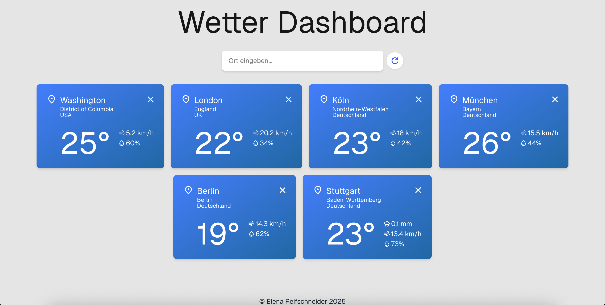

# 🌦️ Weather Dashboard

A fullstack application to display current weather for multiple cities. Users can search for cities, create widgets, update or delete them. The project uses **Next.js (frontend)**, **Node.js + Express (backend)**, **MongoDB**, and an external weather API (open-meteo.com). Includes caching and dynamic UI updates.

---

## 🚀 Features

- Search for cities and view current weather data
- Add weather widgets for multiple locations
- Delete individual widgets
- Update all widgets with one click
- Accessible UI (ARIA attributes, keyboard navigation)
- RAM cache for optimized API usage: Weather data is fetched from the external API only once every 5 minutes per location
- Backend unit tests with Jest
- Responsive design with Tailwind CSS

---

## 🧰 Technologies

- **Frontend:** Next.js, React, TypeScript, Tailwind CSS
- **Backend:** Node.js, Express, MongoDB, Mongoose
- **APIs:** Open-Meteo (weather & geocoding)
- **Testing:** Jest, Supertest

---

## 📁 Project Structure

```
weather-dashboard/
├── backend/
│   ├── __tests__/
│   ├── controllers/
│   ├── models/
│   ├── routes/
│   ├── services/
│   ├── db.js
│   ├── index.js
│   └── .env
├── frontend/
│   ├── src/
│   │   ├── app/
│   │   │   └── page.tsx/
│   │   ├── components/
│   │   ├── icons/
│   │   ├── models/
│   │   └── services/
│   ├── public/
│   └── .env
└── README.md
```

---
## 🌐 Live Demo

- **Frontend:** [https://weather-dashboard-pearl-one.vercel.app](https://weather-dashboard-pearl-one.vercel.app)
- **Backend API:** [https://weather-dashboard-backend-1o3e.onrender.com](https://weather-dashboard-backend-1o3e.onrender.com)
> The backend is an API service. You won’t see a user interface there, but it powers the frontend and responds to requests like `/widget` and `/geocoding/:city`.

---

## ⚙️ Getting Started

### Prerequisites

- Node.js v18+
- MongoDB (locally or via [MongoDB Atlas](https://www.mongodb.com/cloud/atlas))
- NPM or Yarn

### Installation

1. **Clone the repository:**

   ```bash
   git clone https://github.com/reifschneider-helen/weather-dashboard.git
   cd weather-dashboard
   ```

2. **Install dependencies:**

   ```bash
   cd backend
   npm install
   cd ../frontend
   npm install
   ```

3. **Configure environment variables for the backend:**

   ```bash
   # Copy `.env.example` to `.env` and `.env.test.example` to `.env.test` in `backend`
   cd backend
   cp .env.example .env
   cp .env.test.example .env.test
   # Update MONGODB_URI and PORT in .env/.env.test if needed
   ```

   **Example `.env`:**

   ```
   PORT=5000
   MONGODB_URI=mongodb://localhost:27017/widgets
   ```

   **Example `.env.test`:**

   ```
   PORT=5000
   MONGODB_URI=mongodb://localhost:27017/test-widgets
   ```

4. **Configure environment variables for the frontend:**

   ```bash
   cd frontend
   cp .env.example .env
   # Update the backend port if changed in backend/.env
   ```

   **Example `.env`:**

   ```
   NEXT_PUBLIC_API_URL=http://localhost:5050
   ```

---

### Running the App

1. **Start the backend:**

   ```bash
   cd backend
   npm run dev
   ```

2. **Start the frontend:**
   ```bash
   cd frontend
   npm run dev
   ```

Frontend runs at: [http://localhost:3000](http://localhost:3000)  
Backend runs at: [http://localhost:5050](http://localhost:5050) _(default)_

## 🔍 API Overview

| Method | Endpoint           | Description                               |
| ------ | ------------------ | ----------------------------------------- |
| GET    | `/widget`          | Returns all stored widgets                |
| POST   | `/widget`          | Creates a new widget (requires location)  |
| DELETE | `/widget/:id`      | Deletes a specific widget                 |
| GET    | `/geocoding/:city` | Returns city suggestions for autocomplete |

---

## 🧠 Caching

- Weather data is cached in RAM (`backend/services/weatherService.js`).
- For each city (based on name + coordinates), requests within 5 minutes return cached data.
- After 5 minutes, new API calls to Open-Meteo are made.

---

## 🧪 Testing

```bash
cd backend
npm test
```

**Tests included for:**

- **Widget API:**

  - Creating a widget (`POST /widget`) with valid and invalid data
  - Retrieving all widgets (`GET /widget`), including cases with and without widgets in the database
  - Deleting a widget (`DELETE /widget/:id`), including non-existent widgets

- **Geocoding API:**

  - Fetching city suggestions (`GET /geocoding/:city`) for valid and invalid city names
  - Handling cases where no cities are found
  - Error handling for invalid requests

- **Weather Service:**
  - Fetching weather data for valid and invalid coordinates
  - Handling missing or incorrect parameters

---

## ♿ Accessibility

- All interactive elements have ARIA labels and are keyboard-accessible.
- Loading indicators use `aria-live`.
- Color contrast and focus states are considered.

---

## 🖼️ Screenshots



---

## 👩‍💻 Author

**Elena Reifschneider**  
Frontend Developer based in Germany  
[LinkedIn](https://www.linkedin.com/in/elena-reifschneider/) • [GitHub](https://github.com/reifschneider-helen)
